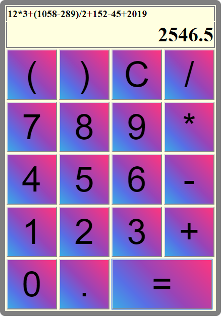

# calculator
Projects are the best way to learn JavaScript, and a calculator is one of the best projects to choose. 
A calculator covers all the complex interactions with UI and JavaScript while still being simple enough for people of any skill level. 
If you want to learn JavaScript or improve your JavaScript skill this is a must do project.

